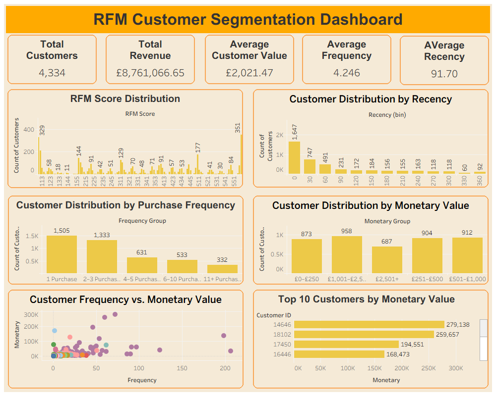

# Customer Segmentation Using RFM Analysis

Excel and Tableau-based customer segmentation project using RFM (Recency, Frequency, Monetary) analysis on real e-commerce transaction data.

## Project Overview

RFM analysis is a customer segmentation technique that evaluates customers based on three behavioral dimensions:

- **Recency (R)** — How recently the customer made a purchase
- **Frequency (F)** — How often the customer placed orders
- **Monetary (M)** — How much the customer spent

Each customer was assigned an RFM score from **1–5** across the three dimensions and analyzed to identify meaningful customer purchasing patterns.

The analysis was performed in **Microsoft Excel**, while **Tableau** was used to create an interactive dashboard for exploring customer behavior and RFM scores.

## Dataset

- **Source:** [E-Commerce Data](https://www.kaggle.com/datasets/carrie1/ecommerce-data) (Kaggle, by carrie1)
- **Raw size:** 541,909 rows × 8 columns
- **Time period:** December 2010 – December 2011
- **Fields:** InvoiceNo, StockCode, Description, Quantity, InvoiceDate, UnitPrice, CustomerID, Country

## Data Cleaning

Data preparation was performed in Excel:

1. Removed transactions with missing CustomerID
2. Removed cancelled orders
3. Removed transactions with negative or zero Quantity/UnitPrice
4. Removed non-product stock codes
5. Removed duplicate transaction rows
6. Added a calculated `TotalPrice` column using Quantity × UnitPrice
7. Corrected data types and formatted financial fields

**Result:** 541,909 → 391,151 clean transaction rows covering **4,334 unique customers**.

## RFM Calculation

1. Established a snapshot date one day after the final transaction as the reference point for Recency.
2. Created customer-level summaries using PivotTables.
3. Calculated:
   - **Recency:** Days since the customer's last purchase
   - **Frequency:** Number of orders placed by the customer
   - **Monetary:** Total customer spending
4. Assigned RFM scores from **1–5** using quartile-based thresholds derived from the dataset.
5. Combined the R, F, and M scores to create customer-level RFM scores.
6. Used the resulting scores to analyze customer purchasing behavior and value.

## RFM Dashboard

The Tableau dashboard provides an interactive view of customer purchasing behavior and RFM scores.

### Dashboard Features

- **RFM Score Distribution**
- **Customer Distribution by Recency**
- **Customer Distribution by Purchase Frequency**
- **Customer Distribution by Monetary Value**
- **Customer Frequency vs. Monetary Value**
- **Top 10 Customers by Monetary Value**
- **Total Customers KPI**
- **Total Revenue KPI**
- **Average Customer Value KPI**
- **Average Frequency KPI**
- **Average Recency KPI**

The dashboard includes interactive RFM selection. Selecting an RFM score updates the relevant charts and KPI values, allowing users to examine the behavior and financial contribution of individual RFM groups.

## Key Insights

- Customers with stronger RFM scores demonstrate substantially higher purchasing activity and monetary contribution.
- Recency reveals clear differences between recently active customers and customers who have become inactive.
- Frequency highlights customers with repeated purchasing behavior and helps distinguish high-engagement customers from occasional buyers.
- Monetary analysis identifies customer groups contributing the greatest value to the business.
- Combining Recency, Frequency, and Monetary metrics provides a more comprehensive understanding of customer behavior than analyzing individual metrics alone.

## Tools Used

- **Microsoft Excel** — Data cleaning, PivotTables, RFM calculations, scoring and analysis
- **Tableau** — Interactive dashboard and data visualization
- **GitHub** — Project documentation and version control

## Files

- `RFM_Customer_Segmentation.xlsx` — Excel workbook containing the cleaned data, RFM calculations and analysis
- `RFM_Customer_Segmentation.twb` — Tableau packaged workbook
- `RFM_Customer_Segmentation_Dashboard` — Tableau dashboard screenshot

> **Note:** The complete Excel workbook may exceed GitHub's file size limit because of the volume of transaction-level data. Where necessary, the full workbook can be hosted externally and linked from this repository.

## Dashboard Preview

## Project Outcome

This project demonstrates an end-to-end customer analytics workflow, from transaction-level data cleaning and RFM calculation in Excel to interactive customer analysis and visualization in Tableau.
